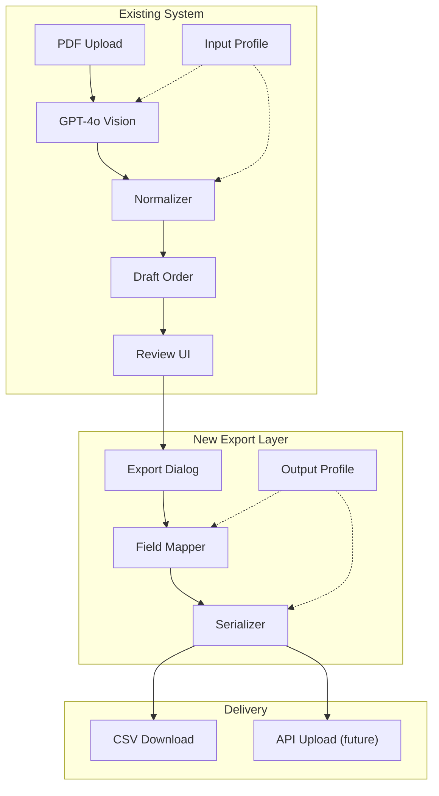

# Modular Export Architecture for Ingestry

A minimal, modular export system to support Xentral CSV and future integrations.

---

## Terminology

| Term | Purpose | Stage |
|------|---------|-------|
| **Input Profile** | Defines what fields to **extract** from PDFs | Ingestion |
| **Output Profile** | Defines how to **map and format** data for export | Export |

> [!NOTE]
> Renaming the existing `processing_profiles` table to `input_profiles` for symmetry. This is a simple migration.

### Consistent Field Naming

To avoid confusion, we use **one term** for extended/custom attributes everywhere:

| ❌ Don't use | ✅ Use instead |
|-------------|----------------|
| freefield, free_field | `custom_field` |
| custom attribute | `custom_field` |
| extended field | `custom_field` |

In Xentral context, `freefield3` becomes `custom_field_3` in our mappings.

---

## Key Concepts

### What is a Serializer?

Converts structured data into output format strings:

```
Records (JS Objects) → Serializer → CSV / JSON / XML string
```

### What is Field Mapping?

Translates your field names to what the target system expects:

```typescript
// Your data (from Input Profile extraction)
{ sku: "ABC123", name: "Cool Sneaker", brand: "Nike" }

// Output Profile mappings
{ source: "sku",   target: "nummer" }
{ source: "name",  target: "name_de" }
{ source: "brand", target: "hersteller" }

// Result → ready for Xentral
{ nummer: "ABC123", name_de: "Cool Sneaker", hersteller: "Nike" }
```

---

## Full Architecture



---

## Core Components (3 files, ~200 LOC)

| File | Purpose |
|------|---------|
| `export/types.ts` | Type definitions for Output Profiles |
| `export/field-mapper.ts` | Applies mappings + templates |
| `export/csv-serializer.ts` | Converts to CSV string |

---

## Types

```typescript
// export/types.ts

export interface OutputProfile {
    id: string;
    tenant_id: string;
    name: string;
    field_mappings: FieldMapping[];
    format: 'csv' | 'json';
    format_options: {
        delimiter?: string;       // Default ";"
        include_header?: boolean; // Default true
    };
}

export interface FieldMapping {
    source: string;       // Key from processed data
    target: string;       // Key in output format
    template?: string;    // Optional: "{brand} - {name}"
    default_value?: string;
}

export type DataRecord = Record<string, unknown>;
```

---

## Phased Implementation

### Phase 1: Core Export Engine
- `src/lib/export/types.ts`
- `src/lib/export/field-mapper.ts`
- `src/lib/export/csv-serializer.ts`

### Phase 2: Database & API
- Migration: `output_profiles` table
- Migration: Rename `processing_profiles` → `input_profiles`
- `POST /api/export` endpoint

### Phase 3: Output Profiles Settings UI
- List/create/edit output profiles
- Visual field mapping builder

### Phase 4: Export Review Dialog
- Select output profile
- Preview mapped data
- Download button

### Phase 5: API Transport (Future)
- Xentral API client when credentials available

---

## Output Profiles UI


The format options (delimiter, header) are shown because:
- Xentral uses `;` delimiter, Shopware might use `,`
- Some systems want headers, others don't

If you prefer, we can **hide these as "Advanced"** and use sensible defaults (`;` + header = true for CSV).

---

## Export Review Dialog

```
┌─────────────────────────────────────────────────────┐
│  Export Order #12345                               │
├─────────────────────────────────────────────────────┤
│  Output Profile: [Xentral CSV ▼]                   │
│                                                     │
│  Preview (first 5 rows):                           │
│  ┌─────────────────────────────────────────────┐   │
│  │ nummer  │ name_de         │ hersteller     │   │
│  ├─────────┼─────────────────┼────────────────┤   │
│  │ ABC123  │ Cool Sneaker    │ Nike           │   │
│  │ DEF456  │ Running Shoe    │ Adidas         │   │
│  └─────────────────────────────────────────────┘   │
│                                                     │
│  Total: 24 products                                │
│                                                     │
│  [Download CSV]                    [Cancel]        │
└─────────────────────────────────────────────────────┘
```

---

## Database Migration

```sql
-- Rename for consistency
ALTER TABLE processing_profiles RENAME TO input_profiles;

-- New output profiles table
CREATE TABLE output_profiles (
    id uuid DEFAULT gen_random_uuid() PRIMARY KEY,
    tenant_id uuid NOT NULL REFERENCES tenants(id),
    name text NOT NULL,
    description text,
    field_mappings jsonb NOT NULL DEFAULT '[]',
    format text NOT NULL DEFAULT 'csv',
    format_options jsonb NOT NULL DEFAULT '{"delimiter": ";", "include_header": true}',
    is_default boolean DEFAULT false,
    created_at timestamptz DEFAULT now()
);

ALTER TABLE output_profiles ENABLE ROW LEVEL SECURITY;
CREATE POLICY "Tenant isolation" ON output_profiles
    FOR ALL USING (tenant_id = get_user_tenant_id());
```

---

## Xentral CSV Seed Profile

```typescript
const XENTRAL_CSV_PROFILE = {
    name: "Xentral CSV",
    format: "csv",
    format_options: { delimiter: ";", include_header: true },
    field_mappings: [
        { source: "sku", target: "number" },
        { source: "name", target: "name_de" },
        { source: "name", target: "name_en" },
        { source: "brand", target: "hersteller" },
        { source: "article_number", target: "supplier order number" },
        { source: "ean", target: "ean" },
        { source: "price", target: "sale_price1net" },
        { source: "category", target: "article_category_name" },
        { source: "color", target: "colour" },
        { source: "gender", target: "custom_field_3" },   // Xentral freefield3
        { source: "season", target: "custom_field_4" },   // Xentral freefield4
        { source: "material", target: "custom_field_7" }, // Xentral freefield7
    ]
};
```

---

## Summary

| Phase | What | Effort |
|-------|------|--------|
| 1 | Core export engine (~200 LOC) | Small |
| 2 | DB table + API endpoint | Small |
| 3 | Output Profiles settings UI | Medium |
| 4 | Export review dialog | Medium |
| 5 | Xentral API transport | Future |

**Total new code:** ~500-800 lines
