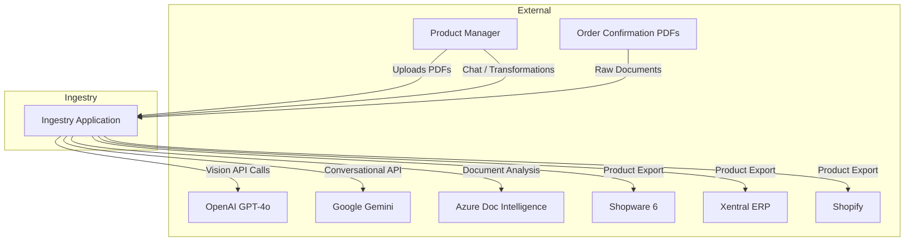
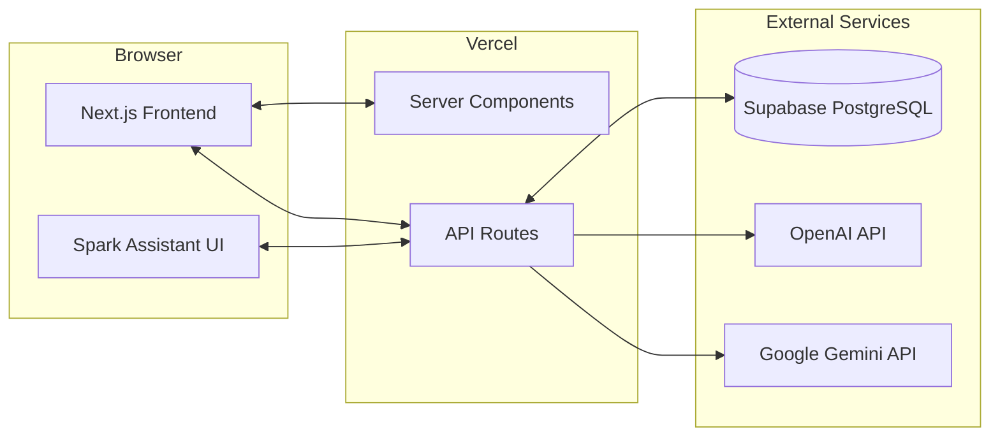
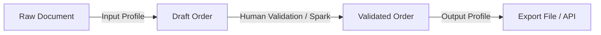
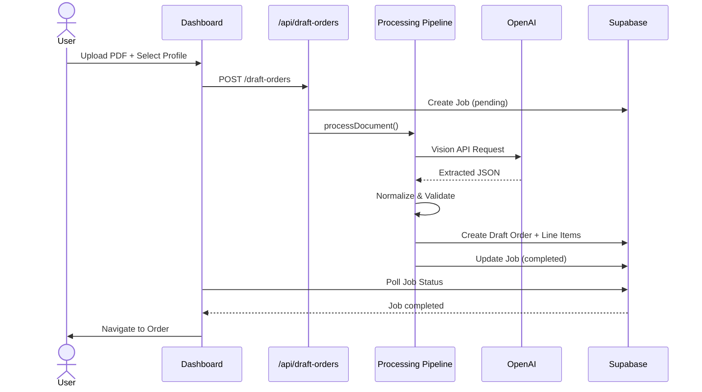
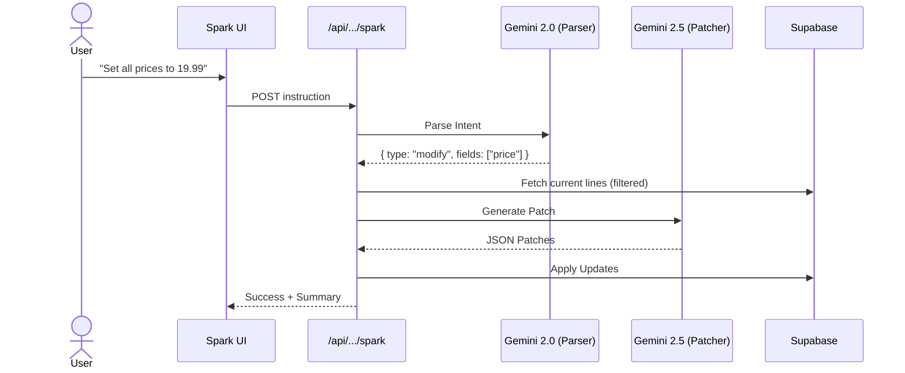
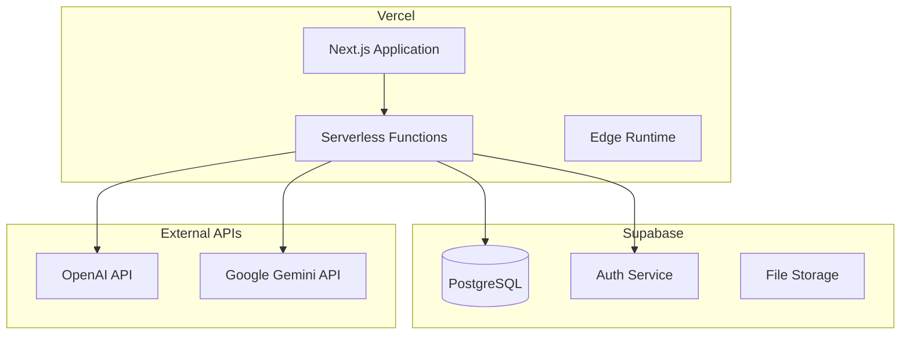

# Ingestry – Arc42 Architecture Documentation

> **Version:** 1.1  
> **Date:** January 2, 2026  
> **Status:** Current

---

## 1. Introduction and Goals

### 1.1 Requirements Overview

**Ingestry** is an intelligent product data ingestion platform designed for fashion retail workflows. The core mission is to transform unstructured product data from order confirmation PDFs into structured, validated data ready for export to various ERP and e-commerce systems.

**Essential Features:**

- **AI-Powered Extraction**: Utilizes GPT-4o Vision to extract product data from complex PDF layouts.
- **Spark Assistant**: A conversational AI (powered by Google Gemini) for natural language data transformation and analysis.
- **Configurable Intake**: Dynamic Input Profiles for defining schema and extraction rules.
- **Lookup-Based Normalization**: Fuzzy matching and alias management for consistent data.
- **Multi-Destination Export**: Adapters for Shopware 6, Xentral ERP, and Shopify.
- **Multi-Tenant Architecture**: Full data isolation via Supabase RLS.

### 1.2 Quality Goals

| Priority | Quality Goal       | Description                                                              |
| -------- | ------------------ | ------------------------------------------------------------------------ |
| 1        | **Accuracy**       | Extraction and Spark transformations must be reliable and verifiable     |
| 2        | **Responsiveness** | Spark Assistant must respond in near real-time (<2s for intent)          |
| 3        | **Flexibility**    | Fully configurable profiles—no hardcoded business logic                  |
| 4        | **Usability**      | Human-in-the-loop validation with efficient bulk editing & AI assistance |
| 5        | **Scalability**    | Multi-tenant isolation, background job processing                        |

### 1.3 Stakeholders

| Role                 | Expectations                                              |
| -------------------- | --------------------------------------------------------- |
| **Product Managers** | Fast, accurate data ingestion; minimal manual corrections |
| **Operations Teams** | Reliable exports; clear job status visibility             |
| **Developers**       | Clean architecture; easy adapter development              |
| **Tenant Admins**    | Self-service profile configuration; lookup management     |

---

## 2. Architecture Constraints

### 2.1 Technical Constraints

| Constraint            | Description                                                  |
| --------------------- | ------------------------------------------------------------ |
| **Next.js 16**        | Application built on App Router with React Server Components |
| **TypeScript**        | Strict typing throughout the codebase                        |
| **Supabase**          | PostgreSQL database with Row-Level Security (RLS)            |
| **OpenAI API**        | GPT-4o Vision for primary document extraction                |
| **Google Gemini API** | Gemini 2.0 Flash / 3.0 for "Spark" conversational features   |
| **Vercel Deployment** | Serverless functions with timeout constraints                |

### 2.2 Organizational Constraints

| Constraint                    | Description                                                               |
| ----------------------------- | ------------------------------------------------------------------------- |
| **Pure Templating**           | All field transformations must be explicitly configured—no magic defaults |
| **Profile-Driven Processing** | All extraction and normalization requires a selected profile              |
| **Human-in-the-Loop**         | Draft orders require manual validation before export                      |

### 2.3 Conventions

| Convention           | Description                                                 |
| -------------------- | ----------------------------------------------------------- |
| **Field Keys**       | Lowercase with underscores (e.g., `style_code`)             |
| **Lookups**          | Canonical names stored, codes accessed via `.code` modifier |
| **Tenant Isolation** | All data tables use `tenant_id` with RLS policies           |

#### UI/UX Conventions

**Spatial Philosophy (Layered Design System)**

| Level | Name    | Usage             | Styling                                                                    |
| ----- | ------- | ----------------- | -------------------------------------------------------------------------- |
| 0     | Canvas  | Global background | `bg-gradient-to-br from-background to-muted/40`                            |
| 1     | Surface | Page containers   | `bg-card/60 backdrop-blur-md ring-1 ring-inset ring-border/50 rounded-2xl` |
| 2     | Overlay | Dialogs, popovers | `bg-card/95 backdrop-blur-sm shadow-xl ring-1 ring-border/50 rounded-xl`   |

> **Never stack Level 1 surfaces.** Nested cards use `bg-muted/30` or `bg-muted/50`.

**Core Styling Rules**

| Convention              | Description                                                                      |
| ----------------------- | -------------------------------------------------------------------------------- |
| **Soft Ring Mandatory** | `border` must always be paired with `ring-1 ring-inset ring-border/50`           |
| **Rounded Corners**     | Cards: `rounded-2xl`; inputs/buttons: `rounded-lg`                               |
| **Glassmorphic Forms**  | `bg-muted/40 border-border/40 focus:bg-background focus-visible:ring-primary/40` |
| **Tactile Feedback**    | All clickables: `active:scale-[0.98]`                                            |
| **Hover States**        | Interactive surfaces: `hover:bg-muted/60`                                        |

**Lineage Color System**

| Type        | Usage                   | Backgrounds                            | Badges                               |
| ----------- | ----------------------- | -------------------------------------- | ------------------------------------ |
| Source (S)  | Extracted from document | `bg-blue-50/30` / `bg-blue-950/20`     | `bg-blue-100` / `bg-blue-900/80`     |
| Virtual (V) | Computed/AI-enriched    | `bg-purple-50/30` / `bg-purple-950/20` | `bg-purple-100` / `bg-purple-900/80` |

---

## 3. System Scope and Context

### 3.1 Business Context



### 3.2 Technical Context



---

## 4. Solution Strategy

### 4.1 Dual-Stage Profile Architecture

Ingestry decouples **how data enters** (Ingestion) from **how it leaves** (Egress):



**Input Profiles** (Ingestion):

- Define AI extraction prompts and field schemas
- Configure normalization rules (lookup types)
- Define computed fields using templates

**Output Profiles** (Egress):

- Map internal fields to external system fields
- Apply templates for combined values
- Configure serialization format (CSV/JSON)

### 4.2 Spark Architecture (Two-Phase AI)

The "Spark" assistant uses a specialized two-phase architecture to optimize for both latency and accuracy:

1.  **Phase 1: Intent Parsing (Gemini 2.0 Flash)**

    - **Goal**: Extremely fast (<1s) determination of user intent.
    - **Output**: Classifies request as `modification`, `question`, or `ambiguous`. Identifies specific target field keys (e.g., `price`, `color`).
    - **Why**: avoids sending massive context windows for simple queries.

2.  **Phase 2: Execution / Patch Generation (Gemini 2.5/3.0)**
    - **Goal**: High-precision JSON patch generation.
    - **Input**: Receive filtered data (only relevant fields identified in Phase 1).
    - **Output**: Exact JSON patches to apply to the draft order line items.

### 4.3 Technology Decisions

| Decision               | Rationale                                                                            |
| ---------------------- | ------------------------------------------------------------------------------------ |
| **Next.js App Router** | Unified frontend/backend, server components for performance                          |
| **Supabase + RLS**     | Managed PostgreSQL with built-in multi-tenancy via Row-Level Security                |
| **GPT-4o Vision**      | State-of-the-art document understanding for complex PDF layouts                      |
| **Google Gemini**      | Superior speed/cost ratio for high-frequency conversational interaction              |
| **shadcn/ui**          | Accessible, customizable component library                                           |
| **Tailwind CSS 4**     | Utility-first styling with design system tokens                                      |
| **Custom DLS**         | Extending shadcn/ui with "Modern App" aesthetics (rings, gradients, semantic colors) |

---

## 5. Building Block View

### 5.1 Level 1: System Overview

```
voo-product-manager/
├── src/
│   ├── app/                    # Next.js App Router
│   │   ├── api/                # REST API endpoints
│   │   ├── dashboard/          # Main application UI
│   │   └── login/              # Authentication
│   ├── components/             # React components
│   ├── lib/                    # Core business logic
│   └── types/                  # TypeScript definitions
├── supabase/
│   └── migrations/             # Database schema
└── public/                     # Static assets
```

### 5.2 Level 2: Core Modules

#### API Layer (`src/app/api/`)

| Module          | Responsibility                                    |
| --------------- | ------------------------------------------------- |
| `draft-orders/` | Order CRUD, line item management, export triggers |
| `jobs/`         | Background job status and monitoring              |
| `lookups/`      | Lookup CRUD and normalization testing             |
| `settings/`     | Input/Output profile management                   |

#### Business Logic (`src/lib/`)

| Module                | Responsibility                                          |
| --------------------- | ------------------------------------------------------- |
| `extraction/`         | AI Client logic (`spark-client.ts`, `openai-client.ts`) |
| `modules/processing/` | Normalization pipeline, validation                      |
| `services/`           | Template engine, lookup normalizer, tenant service      |
| `adapters/`           | Shop system integrations (Shopware, Xentral, Shopify)   |
| `export/`             | Output profile evaluation, serialization                |

#### UI Components (`src/components/`)

| Module         | Responsibility                          |
| -------------- | --------------------------------------- |
| `orders/flow/` | DraftOrderGrid, IngestrySpark (Chat UI) |
| `ui/`          | shadcn/ui base components               |
| `validation/`  | Confidence indicators, warning displays |

---

## 6. Runtime View

### 6.1 PDF Processing Flow



### 6.2 Spark Interaction Flow



---

## 7. Deployment View

### 7.1 Infrastructure



### 7.2 Environment Configuration

| Variable                        | Purpose                              |
| ------------------------------- | ------------------------------------ |
| `NEXT_PUBLIC_SUPABASE_URL`      | Supabase project URL                 |
| `NEXT_PUBLIC_SUPABASE_ANON_KEY` | Supabase anonymous key               |
| `SUPABASE_SERVICE_ROLE_KEY`     | Server-side admin operations         |
| `OPENAI_API_KEY`                | GPT-4o Vision access                 |
| `GOOGLE_GENERATIVE_AI_KEY`      | Google Gemini access for Spark       |
| `MOCK_EXTERNAL_APIS`            | Enable mock adapters for development |

---

## 8. Cross-cutting Concepts

### 8.1 Multi-Tenancy

All data is isolated per tenant using Supabase Row-Level Security:

```sql
CREATE POLICY "Tenant isolation" ON table_name
    FOR ALL USING (tenant_id = get_user_tenant_id());
```

### 8.2 Spark In-Memory Sessions

To support "Undo" functionality without complex database versioning, Spark maintains short-lived sessions in memory (or ephemeral storage) to track recent patches. This allows users to revert the last AI action immediately.

### 8.3 Unified Profiles

Recent architectural shifts moved towards "Unified Profiles" which consolidate prompt definitions and extraction rules into a single schema to reduce complexity between different AI models.

---

## 9. Architecture Decisions

### ADR-1: Profile-Required Processing

**Decision:** All PDF processing requires an explicit Input Profile selection.
**Consequences:** Consistent data, no magic defaults.

### ADR-2: Dual-Stage Profile Architecture

**Decision:** Separate Input Profiles (ingestion) from Output Profiles (egress).
**Consequences:** Greater flexibility and reuse.

### ADR-3: Supabase with Row-Level Security

**Decision:** Use Supabase PostgreSQL with RLS.
**Consequences:** Built-in security; explicit `tenant_id` handling.

### ADR-4: Hybrid AI Strategy (GPT-4o + Gemini)

**Context:** GPT-4o is excellent at Vision but expensive/slower for high-frequency chat.
**Decision:** Use **GPT-4o Vision** for initial extraction and **Google Gemini** (Flash models) for the Spark conversational assistant.
**Consequences:** Optimizes cost and latency. "Spark" feels snappy (Flash 2.0) while extraction remains high-fidelity.

---

## 10. Quality Requirements

### 10.1 Quality Scenarios

| Quality            | Scenario                 | Measure                         |
| ------------------ | ------------------------ | ------------------------------- |
| **Performance**    | Process 50-item PDF      | < 30 seconds                    |
| **Responsiveness** | Spark Intent Recognition | < 1 second                      |
| **Accuracy**       | Field extraction success | > 95% without manual correction |
| **Availability**   | Dashboard uptime         | 99.5%                           |

---

## 11. Risks and Technical Debt

| Risk/Debt            | Description                                | Mitigation                                 |
| -------------------- | ------------------------------------------ | ------------------------------------------ |
| **AI Dependency**    | Reliance on two separate AI providers      | Abstracted client layers; fallback options |
| **Session State**    | Spark Undo relies on ephemeral state       | Move to DB-backed audit log in future      |
| **Schema Evolution** | Profile field changes affect existing data | Migration scripts; template regeneration   |

---

## 12. Glossary

| Term                | Definition                                                                |
| ------------------- | ------------------------------------------------------------------------- |
| **Spark**           | The conversational AI assistant for data transformation.                  |
| **Intent Parser**   | Spark Phase 1: Identifies what the user wants to do (Gemini 2.0).         |
| **Patch Generator** | Spark Phase 2: Creates the actual data changes (Gemini 2.5/3.0).          |
| **Draft Order**     | A processing run containing extracted line items awaiting validation.     |
| **Input Profile**   | Configuration defining AI extraction, normalization, and computed fields. |
| **Output Profile**  | Configuration defining field mapping and export format.                   |
| **Unified Profile** | The consolidated schema for defining intake rules.                        |
| **Tenant**          | Isolated organization account with its own data and configurations.       |

---

_Generated with arc42 template. For more information: [arc42.org](https://arc42.org)_
