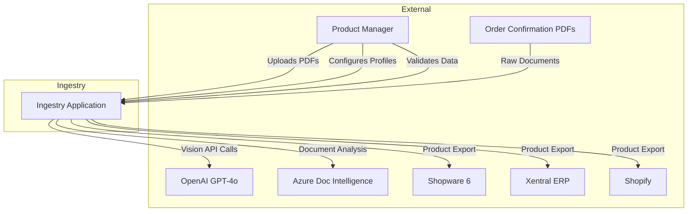
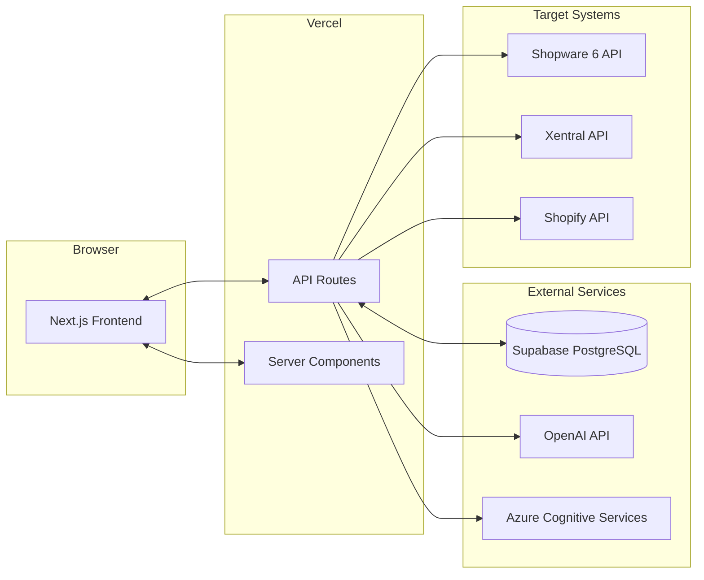
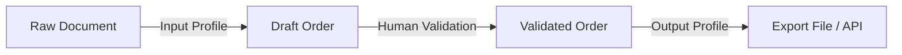
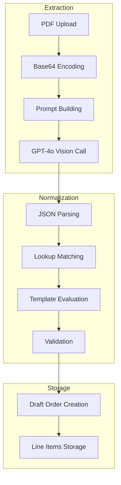
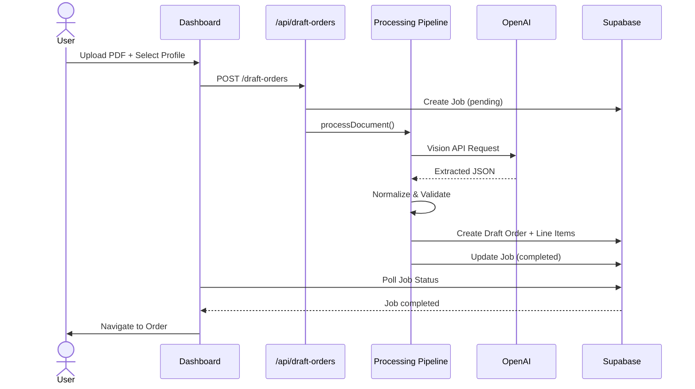
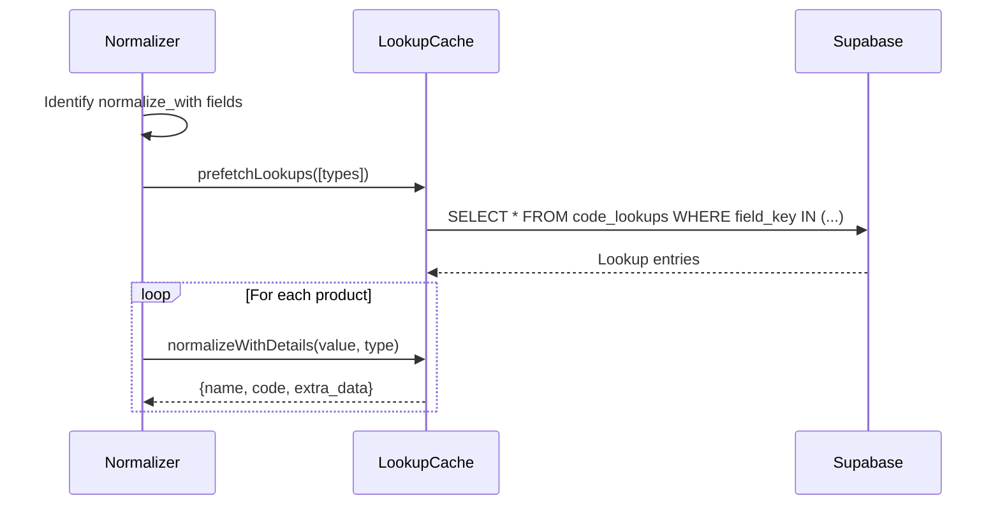
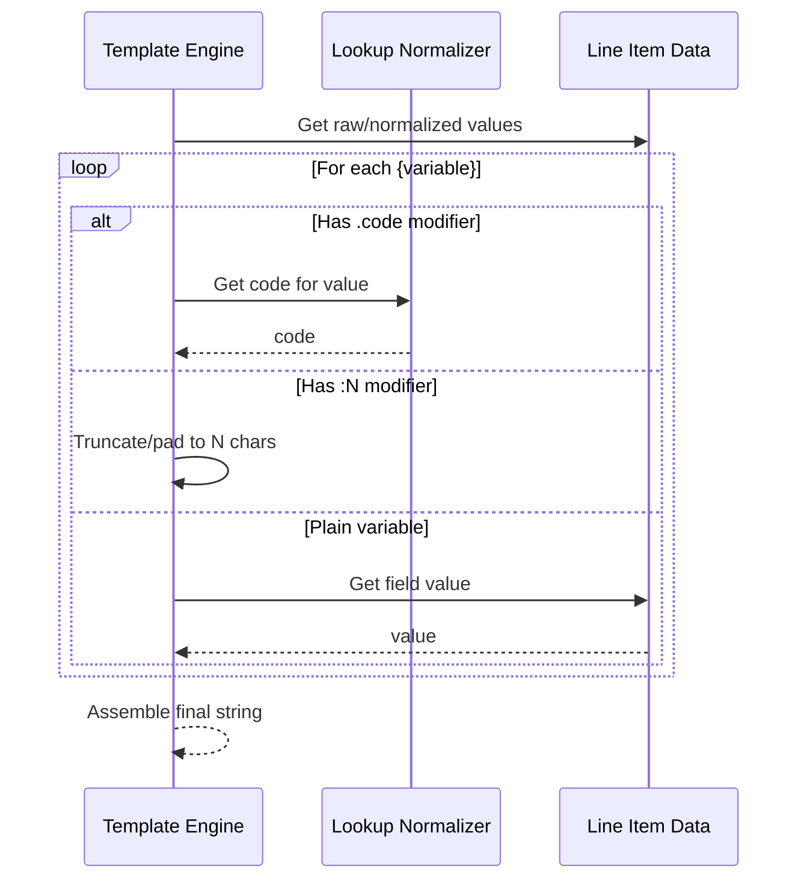
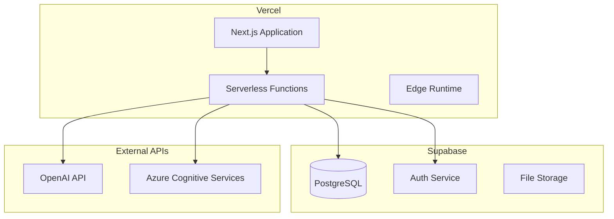
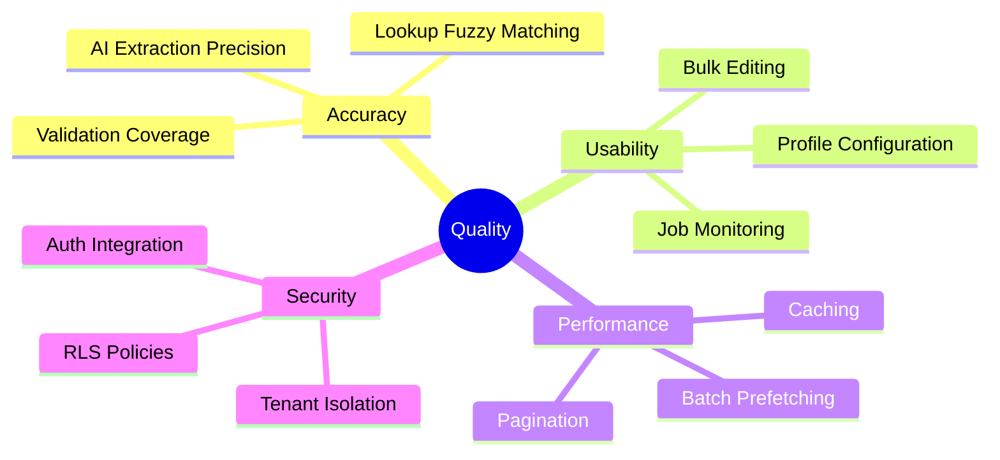

# Ingestry – Arc42 Architecture Documentation

> **Version:** 1.0  
> **Date:** December 25, 2024  
> **Status:** Current

---

## 1. Introduction and Goals

### 1.1 Requirements Overview

**Ingestry** is an intelligent product data ingestion platform designed for fashion retail workflows. The core mission is to transform unstructured product data from order confirmation PDFs into structured, validated data ready for export to various ERP and e-commerce systems.

**Essential Features:**

- AI-powered extraction of product data from PDFs using GPT-4o Vision or Google Gemini
- Configurable intake workflows via Input Profiles
- Lookup-based normalization with fuzzy matching and aliases
- Template-based computed fields (SKUs, product names, IDs)
- Multi-destination export via Output Profiles (Shopware 6, Xentral ERP, Shopify)
- Multi-tenant architecture with full data isolation

### 1.2 Quality Goals

| Priority | Quality Goal      | Description                                                                              |
| -------- | ----------------- | ---------------------------------------------------------------------------------------- |
| 1        | **Accuracy**      | AI extraction must reliably extract product data; normalization ensures consistent codes |
| 2        | **Flexibility**   | Fully configurable profiles—no hardcoded business logic                                  |
| 3        | **Usability**     | Human-in-the-loop validation with efficient bulk editing                                 |
| 4        | **Scalability**   | Multi-tenant isolation, background job processing                                        |
| 5        | **Extensibility** | Modular adapters for new ERP/shop system integrations                                    |

### 1.3 Stakeholders

| Role                 | Expectations                                              |
| -------------------- | --------------------------------------------------------- |
| **Product Managers** | Fast, accurate data ingestion; minimal manual corrections |
| **Operations Teams** | Reliable exports; clear job status visibility             |
| **Developers**       | Clean architecture; easy adapter development              |
| **Tenant Admins**    | Self-service profile configuration; lookup management     |

---

## 2. Architecture Constraints

### 2.1 Technical Constraints

| Constraint            | Description                                                  |
| --------------------- | ------------------------------------------------------------ |
| **Next.js 16**        | Application built on App Router with React Server Components |
| **TypeScript**        | Strict typing throughout the codebase                        |
| **Supabase**          | PostgreSQL database with Row-Level Security (RLS)            |
| **OpenAI API**        | GPT-4o Vision for document extraction                        |
| **Vercel Deployment** | Serverless functions with timeout constraints                |

### 2.2 Organizational Constraints

| Constraint                    | Description                                                               |
| ----------------------------- | ------------------------------------------------------------------------- |
| **Pure Templating**           | All field transformations must be explicitly configured—no magic defaults |
| **Profile-Driven Processing** | All extraction and normalization requires a selected profile              |
| **Human-in-the-Loop**         | Draft orders require manual validation before export                      |

### 2.3 Conventions

| Convention           | Description                                                 |
| -------------------- | ----------------------------------------------------------- |
| **Field Keys**       | Lowercase with underscores (e.g., `style_code`)             |
| **Lookups**          | Canonical names stored, codes accessed via `.code` modifier |
| **Tenant Isolation** | All data tables use `tenant_id` with RLS policies           |

---

## 3. System Scope and Context

### 3.1 Business Context



### 3.2 Technical Context



---

## 4. Solution Strategy

### 4.1 Dual-Stage Profile Architecture

Ingestry decouples **how data enters** (Ingestion) from **how it leaves** (Egress):



**Input Profiles** (Ingestion):

- Define AI extraction prompts and field schemas
- Configure normalization rules (lookup types)
- Define computed fields using templates

**Output Profiles** (Egress):

- Map internal fields to external system fields
- Apply templates for combined values
- Configure serialization format (CSV/JSON)

### 4.2 Technology Decisions

| Decision               | Rationale                                                             |
| ---------------------- | --------------------------------------------------------------------- |
| **Next.js App Router** | Unified frontend/backend, server components for performance           |
| **Supabase + RLS**     | Managed PostgreSQL with built-in multi-tenancy via Row-Level Security |
| **GPT-4o Vision**      | State-of-the-art document understanding for complex PDF layouts       |
| **shadcn/ui**          | Accessible, customizable component library                            |
| **Tailwind CSS 4**     | Utility-first styling with design system tokens                       |

---

## 5. Building Block View

### 5.1 Level 1: System Overview

```
voo-product-manager/
├── src/
│   ├── app/                    # Next.js App Router
│   │   ├── api/                # REST API endpoints
│   │   ├── dashboard/          # Main application UI
│   │   └── login/              # Authentication
│   ├── components/             # React components
│   ├── lib/                    # Core business logic
│   └── types/                  # TypeScript definitions
├── supabase/
│   └── migrations/             # Database schema
└── public/                     # Static assets
```

### 5.2 Level 2: Core Modules

#### API Layer (`src/app/api/`)

| Module          | Responsibility                                    |
| --------------- | ------------------------------------------------- |
| `draft-orders/` | Order CRUD, line item management, export triggers |
| `jobs/`         | Background job status and monitoring              |
| `lookups/`      | Lookup CRUD and normalization testing             |
| `settings/`     | Input/Output profile management                   |

#### Business Logic (`src/lib/`)

| Module                | Responsibility                                        |
| --------------------- | ----------------------------------------------------- |
| `extraction/`         | GPT prompt building, AI response parsing              |
| `modules/processing/` | Normalization pipeline, validation                    |
| `services/`           | Template engine, lookup normalizer, tenant service    |
| `adapters/`           | Shop system integrations (Shopware, Xentral, Shopify) |
| `export/`             | Output profile evaluation, serialization              |

#### UI Components (`src/components/`)

| Module         | Responsibility                                   |
| -------------- | ------------------------------------------------ |
| `orders/flow/` | DraftOrderGrid, bulk editing, validation display |
| `ui/`          | shadcn/ui base components                        |
| `validation/`  | Confidence indicators, warning displays          |

### 5.3 Level 3: Processing Pipeline



---

## 6. Runtime View

### 6.1 PDF Processing Flow



### 6.2 Lookup Normalization



### 6.3 Template Evaluation



---

## 7. Deployment View

### 7.1 Infrastructure



### 7.2 Environment Configuration

| Variable                        | Purpose                                |
| ------------------------------- | -------------------------------------- |
| `NEXT_PUBLIC_SUPABASE_URL`      | Supabase project URL                   |
| `NEXT_PUBLIC_SUPABASE_ANON_KEY` | Supabase anonymous key                 |
| `SUPABASE_SERVICE_ROLE_KEY`     | Server-side admin operations           |
| `OPENAI_API_KEY`                | GPT-4o Vision access                   |
| `AZURE_DOCUMENT_ENDPOINT`       | Azure Document Intelligence (optional) |
| `AZURE_DOCUMENT_KEY`            | Azure API key                          |
| `MOCK_EXTERNAL_APIS`            | Enable mock adapters for development   |

---

## 8. Cross-cutting Concepts

### 8.1 Multi-Tenancy

All data is isolated per tenant using Supabase Row-Level Security:

```sql
CREATE POLICY "Tenant isolation" ON table_name
    FOR ALL USING (tenant_id = get_user_tenant_id());
```

**Key Tables:**

- `tenants` – Organization metadata
- `tenant_members` – User-to-tenant mapping
- `get_user_tenant_id()` – SQL function for policy evaluation

### 8.2 Pure Templating Philosophy

- **No Magic Values**: Fields default to empty string unless explicitly configured
- **Explicit Modifiers**: `.code` for lookups, `:N` for truncation
- **Profile-Driven**: All behavior determined by active Input Profile

### 8.3 Batch Prefetching (Performance)

To avoid N+1 query problems during normalization:

1. Identify all unique `normalize_with` types in profile
2. Execute single `IN` query to fetch all lookups
3. Store in `LookupCache` Map
4. All subsequent lookups are cache-first

### 8.4 Error Handling

- **Validation Flags**: Fields marked `_needs_checking` for confidence-based review
- **Job States**: `pending` → `processing` → `completed` | `failed`
- **RLS Violations**: Explicit `tenant_id` required on all inserts

---

## 9. Architecture Decisions

### ADR-1: Profile-Required Processing

**Context:** Early versions allowed processing without profiles, leading to inconsistent data.

**Decision:** All PDF processing requires an explicit Input Profile selection.

**Consequences:** More consistent data; eliminated "magic" field handling; requires profile setup before first use.

---

### ADR-2: Dual-Stage Profile Architecture

**Context:** Mixing intake and export logic led to rigid, hard-to-maintain configurations.

**Decision:** Separate Input Profiles (ingestion) from Output Profiles (egress).

**Consequences:** Greater flexibility; profiles can be reused across different workflows; clearer separation of concerns.

---

### ADR-3: Supabase with Row-Level Security

**Context:** Multi-tenant data isolation is critical for B2B SaaS.

**Decision:** Use Supabase PostgreSQL with RLS policies tied to `tenant_id`.

**Consequences:** Built-in security at database level; simplified API code; must explicitly enable RLS and provide `tenant_id` on inserts.

---

### ADR-4: GPT-4o Vision as Primary Extractor

**Context:** Need reliable extraction from varied PDF formats.

**Decision:** Use GPT-4o Vision with fallback to Azure Document Intelligence.

**Consequences:** High accuracy on complex layouts; API cost considerations; tenant-configurable model selection.

---

## 10. Quality Requirements

### 10.1 Quality Scenarios

| Quality          | Scenario                 | Measure                         |
| ---------------- | ------------------------ | ------------------------------- |
| **Performance**  | Process 50-item PDF      | < 30 seconds                    |
| **Accuracy**     | Field extraction success | > 95% without manual correction |
| **Availability** | Dashboard uptime         | 99.5%                           |
| **Usability**    | Bulk edit 20 items       | < 60 seconds                    |

### 10.2 Quality Tree



---

## 11. Risks and Technical Debt

| Risk/Debt            | Description                                | Mitigation                                   |
| -------------------- | ------------------------------------------ | -------------------------------------------- |
| **AI Cost**          | High OpenAI API usage costs                | Batch processing; model selection per tenant |
| **Vercel Timeouts**  | Serverless function limits                 | Background job architecture                  |
| **Schema Evolution** | Profile field changes affect existing data | Migration scripts; template regeneration     |
| **Lookup Sync**      | Outdated lookup codes cause SKU mismatches | Template regeneration feature                |

---

## 12. Glossary

| Term               | Definition                                                               |
| ------------------ | ------------------------------------------------------------------------ |
| **Draft Order**    | A processing run containing extracted line items awaiting validation     |
| **Input Profile**  | Configuration defining AI extraction, normalization, and computed fields |
| **Output Profile** | Configuration defining field mapping and export format                   |
| **Code Lookup**    | Canonical value with code and aliases for normalization                  |
| **Computed Field** | Template-evaluated field (e.g., SKU) using `{variable}` syntax           |
| **Tenant**         | Isolated organization account with its own data and configurations       |
| **Normalization**  | Process of mapping raw extracted values to canonical lookup entries      |
| **RLS**            | Row-Level Security—PostgreSQL feature for row-based access control       |

---

## Appendix A: Database Schema

### Core Tables

| Table                | Purpose                             |
| -------------------- | ----------------------------------- |
| `tenants`            | Organization accounts               |
| `tenant_members`     | User-tenant membership              |
| `input_profiles`     | Extraction & normalization config   |
| `output_profiles`    | Export mapping config               |
| `code_lookups`       | Normalization values with codes     |
| `draft_orders`       | Processing orders with metadata     |
| `draft_line_items`   | Individual products in orders       |
| `jobs`               | Background job tracking             |
| `lookup_column_defs` | Custom schema extensions per tenant |

---

## Appendix B: API Reference

### Draft Orders

| Method | Endpoint                            | Description                     |
| ------ | ----------------------------------- | ------------------------------- |
| GET    | `/api/draft-orders`                 | List orders (paginated)         |
| POST   | `/api/draft-orders`                 | Create order (upload + process) |
| GET    | `/api/draft-orders/[id]`            | Get order details               |
| PATCH  | `/api/draft-orders/[id]`            | Update order status             |
| POST   | `/api/draft-orders/[id]/line-items` | Update line items               |
| POST   | `/api/draft-orders/[id]/submit`     | Export to shop system           |

### Settings

| Method | Endpoint                      | Description          |
| ------ | ----------------------------- | -------------------- |
| GET    | `/api/settings/profiles`      | List Input Profiles  |
| POST   | `/api/settings/profiles`      | Create Input Profile |
| PUT    | `/api/settings/profiles/[id]` | Update Input Profile |
| DELETE | `/api/settings/profiles/[id]` | Delete Input Profile |

---

_Generated with arc42 template. For more information: [arc42.org](https://arc42.org)_
